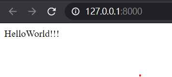

# HiDjango

# How to use ?

```
python manage.py runserver

Watching for file changes with StatReloader
Performing system checks...

System check identified no issues (0 silenced).

You have 18 unapplied migration(s). Your project may not work properly until you apply the migrations for app(s): admin, auth, contenttypes, sessions.
Run 'python manage.py migrate' to apply them.
January 03, 2021 - 22:23:43
Django version 3.1.4, using settings 'useDjango.settings'
Starting development server at http://127.0.0.1:8000/
Quit the server with CTRL-BREAK.
```

# OPEN Browser to http://127.0.0.1:8000/

